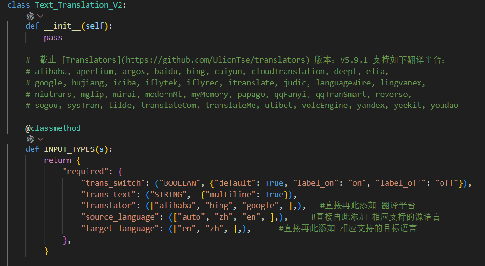
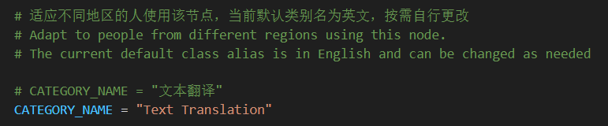
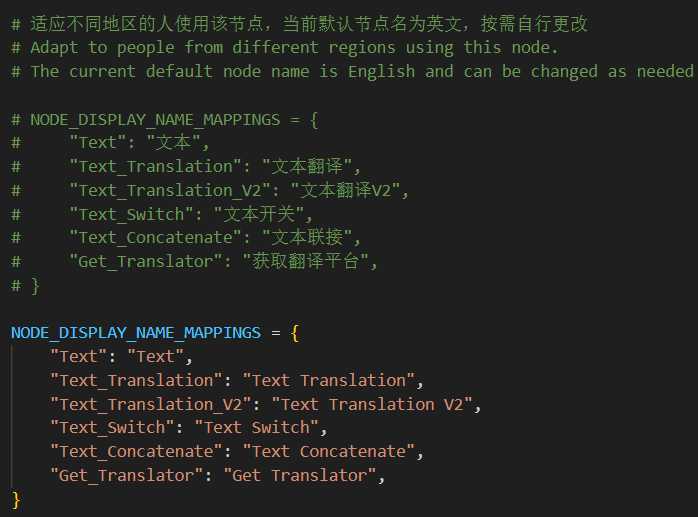

# 文本翻译
该自定义节点扩展 适用于 [ComfyUI](https://github.com/comfyanonymous/ComfyUI)。

现版本无需申请翻译API，直接使用即可。

现已添加的翻译平台：阿里巴巴（Alibaba）、必应（Bing）、谷歌（Google）。

现已添加的翻译语言：中文（zh）、英文（en）。

更多翻译平台请见 [Translators](https://github.com/UlionTse/translators)。其他的 翻译平台、翻译语言 等 需要自行添加，下文会给出其操作方法。

## 注意：
1、更新前 需要将2024年05月19日前使用的老项目删除，当前项目与老项目完全不兼容。

2、该项目之前的项目名为 `ComfyUI_Text_Translation_zh_CN` 现修改为     `ComfyUI_Text_Translation`。

## 1、节点如下：
### 文本翻译


默认使用必应翻译平台，自动识别语言翻译成英文。

### 文本翻译 V2


默认隐藏多余选项，点击 `Show / Hide button` 显示或隐藏更多选项。

### 文本联接


自动根据连接的数量增加/减少 输入端，将输入端的值拼接成一个字符串。

### 文本


文本输入框。

### 文本开关


文本开关，关闭则输出空字符串。

### 获取翻译平台列表


获取翻译平台列表，同时会在终端上显示。


想要在ComfyUI上显示输出文本可以使用，如 [ComfyUI-Custom-Scripts](https://github.com/pythongosssss/ComfyUI-Custom-Scripts) 中的 `ShowText` 或其他节点

## 2、安装

### （1）添加该节点到&nbsp;ComfyUI

#### &ensp;1） 方式一：克隆本项目

  ```
  cd custom_nodes
  ```

  ```
  git clone https://github.com/TFL-TFL/ComfyUI_Text_Translation.git
  ```
#### &ensp;2） 方式二：直接下载ZIP

下载解压后放入`custom_nodes`内

### （2）配置环境

  ```
  cd ComfyUI_Text_Translation
  ```

如果你下载的是&ensp;ComfyUI&ensp;的 便携版本，可直接执行下面代码，否则请将 `requirements.txt` 内的依赖安装到对应位置。
  ```
  ..\..\..\python_embeded\python.exe -s -m pip install -r requirements.txt
  ```
#### （3）更改 翻译平台、翻译语言
截止 [Translators](https://github.com/UlionTse/translators) 版本：v5.9.1 支持如下翻译平台：

```
alibaba -- 阿里巴巴（Alibaba）
apertium -- Apertium
argos -- Argos
baidu -- 百度（Baidu）
bing -- 必应（Bing）
caiyun -- 彩云（Caiyun）
cloudTranslation -- 云翻译（CloudTranslation）
deepl -- DeepL
elia -- Elia
google -- 谷歌（Google）
hujiang -- 沪江（Hujiang）
iciba -- 金山词霸（ICIBA）
iflytek -- 讯飞（iFlytek）
iflyrec -- 讯飞语音识别（iFlyrec）
itranslate -- iTranslate
judic -- Judic
languageWire -- LanguageWire
lingvanex -- Lingvanex
niutrans -- 牛翻译（Niutrans）
mglip -- Mglip
mirai -- Mirai
modernMt -- ModernMT
myMemory -- MyMemory
papago -- Papago
qqFanyi -- QQ翻译（QQFanyi）
qqTranSmart -- QQ智能翻译（QQTranSmart）
reverso -- Reverso
sogou -- 搜狗（Sogou）
sysTran -- Systran
tilde -- Tilde
translateCom -- Translate.com
translateMe -- TranslateMe
utibet -- UTibet
volcEngine -- VolcEngine
yandex -- Yandex
yeekit -- Yeekit
youdao -- 有道（Youdao）
```
 在 &ensp;  .custom_nodes/ComfyUI_Text_Translation/nodes/text.py &ensp; 文件的如下位置修改：
  

#### （4）修改节点显示的语言
在 &ensp;  .custom_nodes/ComfyUI_Text_Translation/nodes/text.py &ensp; 文件的 开头和 结尾 位置修改：

修改节点类别：



修改节点名称：



#### （5）重启ComfyUI

  所有的步骤都操作完啦，可以愉快的创作呦！

### 4、更新日志
#### 2024-05-19
1、弃用腾讯翻译API，简化配置，使用&nbsp;[Translators](https://github.com/UlionTse/translators)&nbsp;提供的方式进行翻译，无需申请密钥了。

2、完全重写节点，新增或修改 “文本翻译”、“文本翻译 V2”、 “获取翻译平台列表”、“文本”、“文本开关”、“文本联接” 节点。


#### 2023-08-27

&emsp;去除“翻译开关”的默认值，以便适配&nbsp;[StableSwarmUI](https://github.com/Stability-AI/StableSwarmUI)&nbsp;，不然该开关的值会由“可选择类型”变成“要输入类型的文字”。

#### 2023-08-22

&emsp;初始提交，节点采用了[腾讯翻译API](https://cloud.tencent.com/product/tmt)进行文本翻译。


  