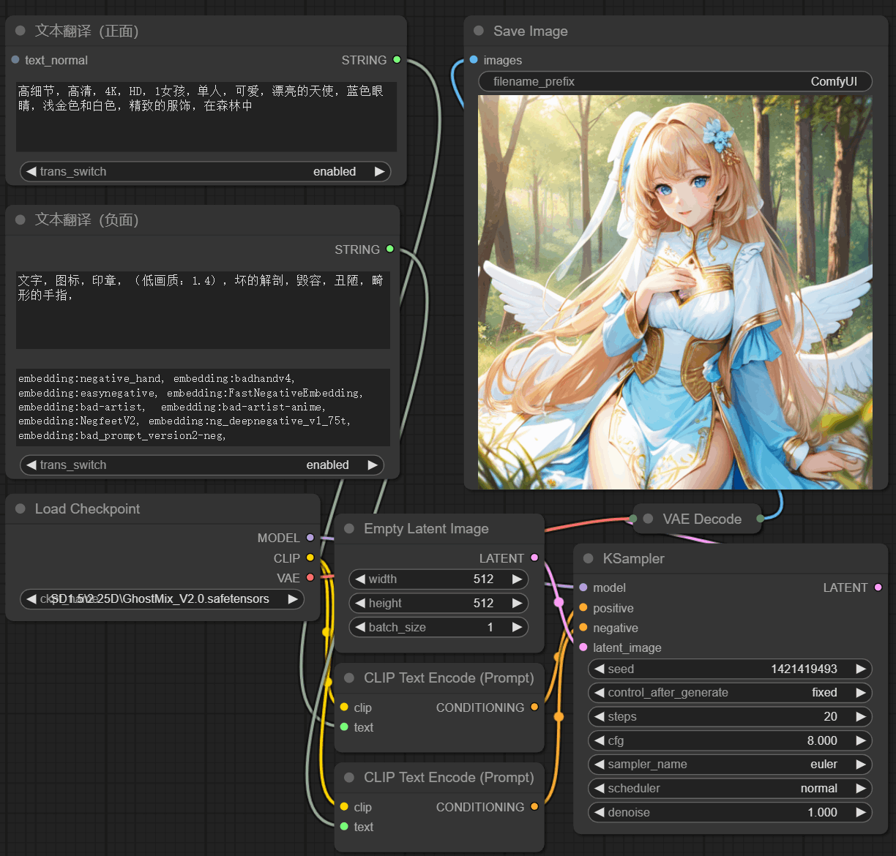
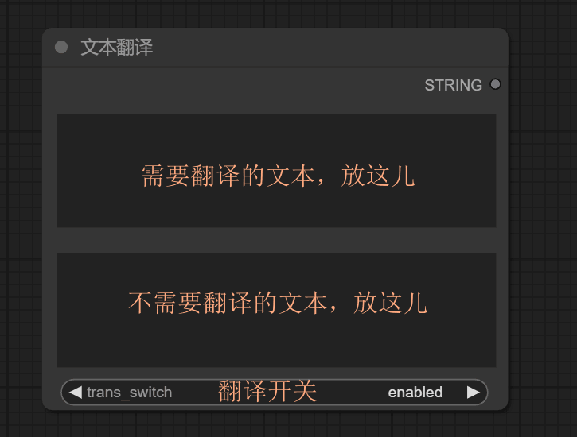
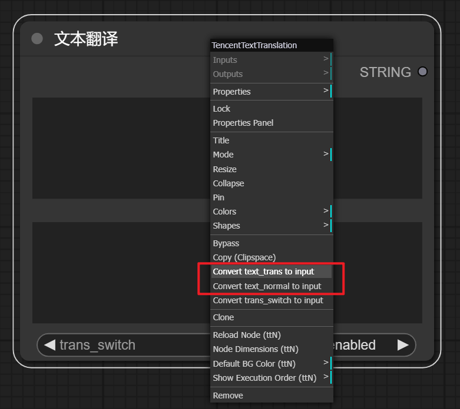
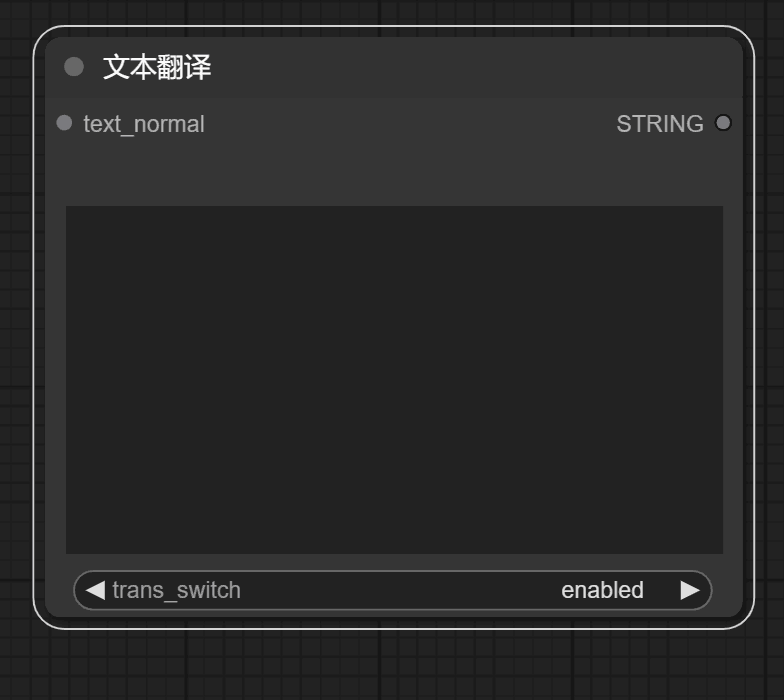
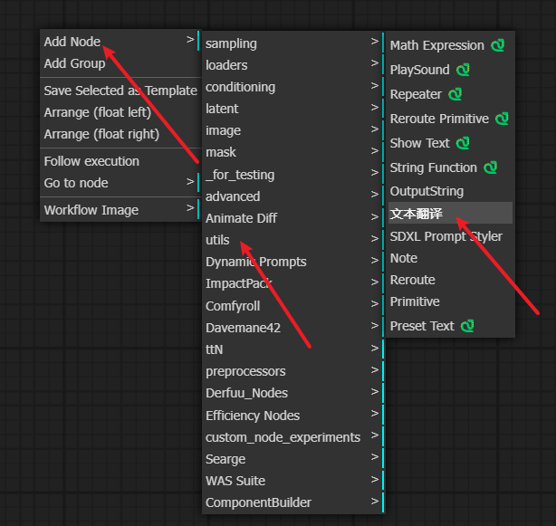
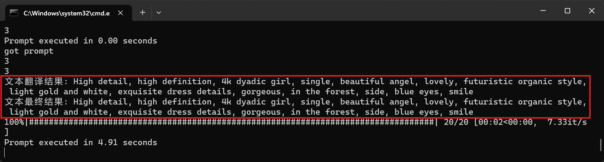
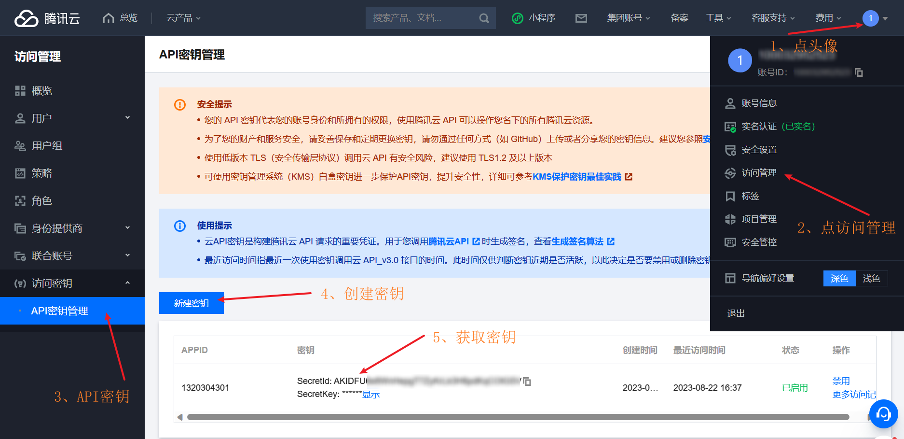
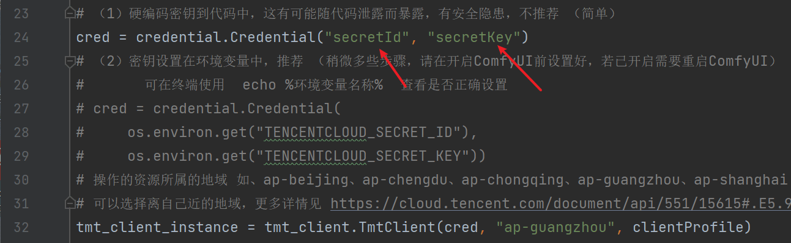

# 文本翻译
该自定义节点扩展 适用于 [ComfyUI](https://github.com/comfyanonymous/ComfyUI)。

可以自动识别输入的语言类型，并将其翻译成英语。


## 效果如下


## 说明
- 该节点采用了[腾讯翻译API](https://cloud.tencent.com/product/tmt)进行文本翻译。
- 可能会许多人需要使用这种类型的节点，但我目前尚未找到相关的开放资源，所以把这个分享给大家。
- 鉴于当前为个人使用的节点，暂时仅支持一个翻译API。如果将来有更多用户使用，可以考虑添加更多API支持。
- 因为日常并不经常使用Python，且刚刚接触了这个语言和ComfyUI自定义节点，所以可能存在一些未知的BUG。但目前为止，自己使用过程中尚未遇到过BUG。
- 随着使用这个节点，我将会对它进行修改、新增以及完善。
- 如果这对你有所帮助，可以给一个小星星呀~

## 开始正文
### 1、节点介绍
（1）节点有两个文本输入和一个翻译启用开关

  

翻译开关：开启（enabled）；关闭（disabled）

（2）开启翻译后，如果在 “需翻译文本” 位置输入的内容不含有汉字，则不会调用 翻译API（避免浪费资源）。

（3）如果想不显示“不需要翻译文本”的输入框，在该节点上点击鼠标右键，把将 text_normal 转换成输入模式即可，并不会影响功能。

`text_trans 为需要翻译的文本`  `text_normal 为无需翻译的文本`

    


（4）添加该节点，可以在 &nbsp; utils &nbsp;中选择,也可以双击鼠标左键搜索 `TencentTextTranslation`。

    


（5）如果想要查看翻译后的文本，你可以在打开ComfyUI时弹出来的终端上查看。

   

当然你也可以选择在 &ensp;  .node/tencent_translation.py &ensp; 文件中，把输出语句前加 “#” 注释掉。

   

（不显示它，用处不大。建议保留，可用于检查文本翻译是否正常。）

如果在有这个输出语句的前提下，终端上没有显示，那么会是这个翻译API或代码有问题，可以向我反馈。当然请求翻译API时有问题也会在终端上显示。

（6）如果你想修改翻译后的语言类型等功能，可在代码里修改。想要达到 &ensp; WebUI &ensp; 中可实时翻译或点击翻译的效果，该节点目前做不到，因为我不了解js脚本。

（7）代码里有注释，便于理解。

### 2、安装
（1）获取&nbsp;[腾讯翻译API](https://cloud.tencent.com/product/tmt)&nbsp;密钥（API接口说明：[腾讯翻译API文档](https://cloud.tencent.com/document/api/551/15619)）

在浏览器搜索 &nbsp;  “腾讯机器翻译” &nbsp;  或点击 &nbsp; [腾讯翻译](https://cloud.tencent.com/product/tmt) &nbsp; 前往，

登录自己的账号后依次点击 &nbsp;头像&nbsp; >>&nbsp;访问管理&nbsp; >>&nbsp;API密钥管理&nbsp;>>&nbsp;创建密钥&nbsp;>>&nbsp;复制密钥&nbsp;

  

(2) 安装 &nbsp; 腾讯翻译SDK &nbsp;(更多安装介绍：[腾讯翻译SDK文档](https://cloud.tencent.com/document/sdk/Python))。

请先确定你使用的&nbsp;ComfyUI&nbsp;的&nbsp;Python&nbsp;目录在哪里，在终端中切换到该目录下，输入以下命令：

  ```
  pip install --upgrade tencentcloud-sdk-python
  ```
或者使用国内镜像
  ```
  pip install -i https://mirrors.tencent.com/pypi/simple/ --upgrade tencentcloud-sdk-python
  ```

(勿将SDK添加错位置，否则无效）

（3）添加该节点到&nbsp;ComfyUI

&ensp;1） 克隆本项目

  ```
  cd custom_nodes
  ```

  ```
  git clone https://github.com/TFL-TFL/ComfyUI_Text_Translation_zh_CN.git
  ```
&ensp;2） 直接下载ZIP

下载解压后放入`custom_nodes`内


（4）配置密钥

&ensp;1） 直接写在代码里，在 &ensp;  .custom_nodes/ComfyUI_Text_Translation_zh_CN/node/tencent_translation.py &ensp; 文件里，
找到`cred = credential.Credential("secretId", "secretKey")`这里填上你的密钥（&nbsp;"secretId" &nbsp;和&nbsp; "secretKey"&nbsp;）该方式有泄露密钥的风险，不推荐，但简单。

  

&ensp;2） 放在环境变量里，添加`TENCENTCLOUD_SECRET_ID`和`TENCENTCLOUD_SECRET_KEY`，稍微多些步骤，但安全。（请在启动ComfyUI前设置好，若已启动
需要重启&nbsp;ComfyUI）

  

可在终端使用  `echo %环境变量名称%`  查看环境变量是否设置正确。

（5）重启ComfyUI

  所有的步骤都操作完啦，可以愉快的创作呦！

### 3、其他
我对比了阿里、百度、有道、腾讯这些翻译API，其中腾讯每月免费可用的量是最大的，所以选择用它。

至于为什么没有选择免费的API，只是觉得这些API稳定性稍差，便没有考虑。

